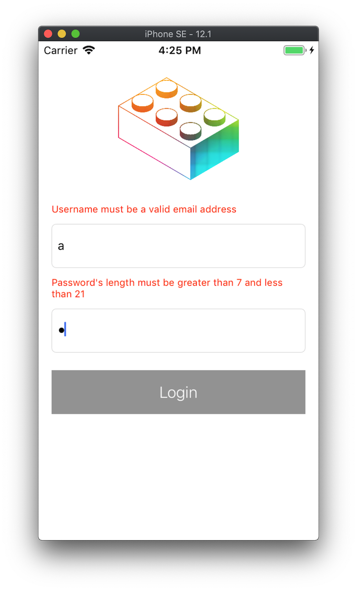
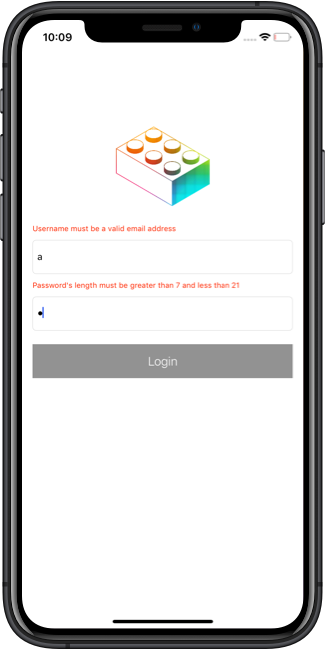

## Demo VIPER Architecture

*Written by: __Nguyen Minh Tam__*

Source code được viết cho bài này là một ứng dụng nhỏ bao gồm các màn hình: Login, Category List và Category Detail.


### Các phần chính của VIPER:

- View: Hiển thị những gì nó được cho bởi Presenter và chuyển tiếp tác vụ của người dùng ngược lại tới Presenter
- Interactor: Chứa business logic của một use case nhất định
- Presenter: 
 - Chứa view logic để chuẩn bị cho việc hiển thị (ví dụ như khi nhận được dữ liệu từ Interactor)
 - Phản hồi tại tác vụ của người dùng (bằng cách yêu cầu dữ liệu mới tới Interactor)
- Entity: Chứa model object cơ bản được sử dụng bởi Interactor
- Router: Chứa navigation logic để biết được màn hình nào được hiển thị và hiển thị theo thứ tự nào.

<center>
	 
</center>


### Thứ tự implementing VIPER

Mình sử dụng thứ tự implementing này khi làm việc với VIPER. Theo mình, thứ tự này khá ổn định trong suốt quá trình building một application, bắt đầu bởi việc xem xét product cần phải làm gì, đến việc user sẽ tương tác với nó như thế nào.
 
- Interactor
- Entity
- Presenter
- View
- Routing


#### Interactor

Interactor đại diện cho một use case trong app. Chứa business logic điều khiển các model object (Entity) để cung cấp cho một task nhất định. Công việc được thực hiện bởi Interactor nên độc lập với UI.

Bắt đầu với ví dụ màn hình login, những business logic cơ bản cần có trong màn hình này: validate username, validate password và cuối cùng là login. Vậy nên Interactor cần được khai báo các function cơ bản tương tự. Ngoài ra, vì chức năng login cần phải tương tác với Entity cho mục đích lấy dữ liệu, vậy nên Interactor lúc này sẽ sở hữu thêm thuộc tính Entity.

Định nghĩa các property và function trên trong `protocol LoginInteractorProtocol` như sau:

```swift
protocol LoginInteractorProtocol {
    var entity: UserEntityProtocol? { get set }

    func validateUsername(_ username: String?) throws
    func validatePassword(_ password: String?) throws
    func login(username: String?, password: String?, completion: ((CompletionResult) -> Void)?) throws
}
```

Tiếp theo, implement `protocol LoginInteractorProtocol` trong `class LoginInteractor`:

```swift
final class LoginInteractor: LoginInteractorProtocol {
    var entity: UserEntityProtocol?

    func validateUsername(_ username: String?) throws {
        // Throw UsernameError
    }

    func validatePassword(_ password: String?) throws {
	     // Throw PasswordError 
	 }

    func login(username: String?, password: String?, completion: ((CompletionResult) -> Void)?) throws {
        // TODO: - (a)
    }
}
```
 
 
#### Entity

Entity là các model object chỉ được sử dụng bởi Interactor.
 
Trong ví dụ login, cần entity có chức năng login với username và password, định nghĩa trong `protocol UserEntityProtocol ` như sau:

```swift
protocol UserEntityProtocol {
    func login(username: String, password: String,
               completion: ((CompletionResult) -> Void)?)
}
```

Đối với trường hợp sử dụng local database, mình implement protocol trên trong `class UserLocalDB` như sau:

```swift
final class UserLocalDB: UserEntityProtocol {
    func login(username: String, password: String, completion: ((CompletionResult) -> Void)?) {
        guard username == "nmint8m@gmail.com" && password == "123456789" else {
            completion?(.failure(NSError(domain: "", code: 999, userInfo: nil)))
            return
        }
        completion?(.success)
    }
}
```

Đối với trường hợp gửi request, mình sẽ implement protocol trên trong `class UserHttpServiceDB`. Khi set up (ở Router), mình có thể kiểm tra network để chọn sử dụng local database khi không có mạng và ngược lại.

Quay lại với `class LoginInteractor`, sử dụng Entity để xử lý việc login:

```swift
final class LoginInteractor: LoginInteractorProtocol {
    ...
    func login(username: String?, password: String?, completion: ((CompletionResult) -> Void)?) throws {
        // TODO: - (a)
        try validateUsername(username)
        try validatePassword(password)
        guard let username = username, !username.isEmpty,
            let password = password, !password.isEmpty else { return }
        entity?.login(username: username, password: password, completion: completion)
    }
}
```
Vậy là xong Interactor và Entity, tiếp sau đây là Presenter.


#### Presenter

Như đã đề cập phía trên, Presenter chứa view logic để chuẩn bị cho việc hiển thị, nó cho biết thời điểm nào dữ liệu được hiển thị trên UI. Nó thu thập dữ liệu đầu vào từ thao tác người dùng, sau đó cập nhật UI hay gửi request dữ liệu đến Interactor.

Presenter còn có nhiệm vụ nhận kết quả từ Interactor và chuyển đổi kết quả sao cho thích hợp để hiển thị lên View.

Quay lại với ví dụ màn hình login:

|  |  |
|---|---|
| Màn hình login | Lỗi validate dữ liệu |

Khi người dùng chọn nút Login ở View, View sẽ yêu cầu Presenter xử lý tác vụ validate username và password. Presenter tiếp tục yêu cầu Interactor xử lý hai tác vụ trên và trả về kết quả. Nếu có lỗi với dữ liệu nhập thì Presenter yêu cầu View hiển thị lỗi, còn những lỗi khác thì Presenter yêu cầu Router hiển thị arlert. Nếu không có lỗi thì Presenter yêu cầu Router hiển thị category list.

Mình định nghĩa `protocol LoginPresenterProtocol` như sau:

```swift
protocol LoginPresenterProtocol { // TODO: - (b)
    var view: LoginViewProtocol? { get set }
    var router: LoginRouter? { get set }
    var interactor: LoginInteractorProtocol? { get set }
}
```

Presenter có nhiệm vụ xử lý các view logic. Ở ví dụ này, view logic là khi Presenter nhận được `Error`, nếu là `UsernameError` thì hiển thị ở `usernameErrorLabel`, nếu là `PasswordError` thì hiển thị ở `passwordErrorLabel`, những error khác thì hiện pop up. `class LoginPresenter` implement `protocol LoginPresenterProtocol` như sau:

```swift
final class LoginPresenter: LoginPresenterProtocol {

    // MARK: - Properties
    private var isNeededValidate = false

    // MARK: - LoginPresenterProtocol
    weak var view: LoginViewProtocol? // TODO: - (f)
    var router: LoginRouter?
    var interactor: LoginInteractorProtocol?

    // MARK: - Functions
    func showValidateError(_ error: Error) {
        if let error = error as? UsernameError {
            view?.showUsernameError(error.localizedDescription)
        } else if let error = error as? PasswordError {
            view?.showPasswordError(error.localizedDescription)
        } else {
            router?.showError(error)
        }
    }
}
```

Tới đây chỉ mới thấy cách Presenter đưa dữ liệu lên View. Tiếp theo đây, mình sẽ giới thiệu cách tương tác từ View đến Presenter.


#### View

Presenter không nên truy cập được các thành phần của View như UILabel, UITableView,... Presenter chỉ nên biết về những nội dung mà nó chứa đựng và khi nào hiển thị. View sẽ tự quyết định nội dung được hiển thị ở đâu.

View và các view controller handle các tác vụ người dùng và dữ liệu đầu vào. Tuy nhiên, chúng không nên trực tiếp thực hiện các logic, thay vào đó nên pass những event đó tới Presenter.

Ví dụ đầu tiên mình muốn đưa ra thuộc về màn hình login, mình định nghĩa `protocol LoginViewProtocol` như sau:

```swift
// MARK: LoginViewProtocol
protocol LoginViewProtocol: class {
    var handler: LoginViewHandler? { get set } // TODO: - (c1)

    func showUsernameError(_ message: String)
    func showPasswordError(_ message: String)
}

// MARK: - LoginViewHandler
protocol LoginViewHandler {
    // Datasource

    // Delegate
    func validateUsername(_ username: String?)
    func validatePassword(_ password: String?)
    func login(username: String?, password: String?)
}
```

`protocol LoginViewProtocol` được adopt và implement trong `class LoginVC` như sau:

```swift
final class LoginVC: UIViewController, LoginViewProtocol {
    ...
    // MARK: - IBActions
    @IBAction func textFieldEditingChanged(_ sender: UITextField) {
        guard let text = sender.text else { return }
        switch sender {
        case usernameTextField:
            handler?.validateUsername(text)
        case passwordTextField:
            handler?.validatePassword(text)
        default: break
        }
    }

    @IBAction func loginButtonTouchInside(_ sender: UIButton) {
        let username = usernameTextField.text
        let password = passwordTextField.text
        handler?.login(username: username, password: password)
    }

    // MARK: - LoginViewProtocol
    var handler: LoginViewHandler?

    func showUsernameError(_ message: String) {
        usernameErrorLabel.text = message
    }

    func showPasswordError(_ message: String) {
        passwordErrorLabel.text = message
    }
}
```

Đối với những màn hình hiển thị danh sách như `UITableView` hoặc `UICollectionView`, mình sẽ định nghĩa theo cách sau. Ví dụ màn hình category list chứa một `UITableView`, các function lấy dữ liệu cần thiết (datasource) đều được khai báo trong `protocol CategoryListHandler`:

```swift
protocol CategoryListViewProtocol: class {
    var handler: CategoryListHandler? { get set }

    func reloadCategoryList()
}

protocol CategoryListHandler {
    // Datasource
    func getNumberOfCategories() -> Int
    func getCategory(at index: Int) -> CategoryModel?

    // Delegate
    func getAllCategories()
    func showCategoryDetail(at index: Int)
}
``` 

`class CategoryListVC` adopt `protocol CategoryListViewProtocol` và implement như sau:

```swift
final class CategoryListVC: UIViewController, CategoryListViewProtocol {
    ...
    // MARK: - CategoryListViewProtocol
    var handler: CategoryListHandler?

    func reloadCategoryList() {
        let count: Int = handler?.getNumberOfCategories() ?? 0
        tableView.isHidden = count == 0
        tableView.reloadData()
    }
}

// MARK: - UITableViewDataSource, UITableViewDelegate
extension CategoryListVC: UITableViewDataSource, UITableViewDelegate {
    func tableView(_ tableView: UITableView, numberOfRowsInSection section: Int) -> Int {
        return handler?.getNumberOfCategories() ?? 0
    }
    ...
    
    // TODO: - (d)
    func tableView(_ tableView: UITableView, didSelectRowAt indexPath: IndexPath) { 
        handler?.showCategoryDetail(at: indexPath.row)
    }
}
```

`var handler` được mình khai báo ở `// TODO: - (c1)` mục đích vừa là datasource, vừa là delegate giúp View giao tiếp với Presenter. `protocol LoginPresenterProtocol` sẽ adopt `protocol LoginViewHandler`.

```swift
protocol LoginPresenterProtocol: LoginViewHandler { // TODO: - (b)
    ...
}
```

Các class adopt `protocol LoginPresenterProtocol` sẽ implement các function cần thiết. Bên cạnh đó, các dữ liệu cần thiết ở Presenter đều được lấy từ Interactor. Công việc điều hướng sang màn hình khác sẽ được chuyển cho Router. 

Trong ví dụ ở đây, `class LoginPresenter` (adopt `protocol LoginPresenterProtocol`) sẽ được implement như sau:

```swift
extension LoginPresenter {
    func validateUsername(_ username: String?) {
        ...
    }

    func validatePassword(_ password: String?) {
        ...
    }

    func login(username: String?, password: String?) {
        isNeededValidate = true
        do {
            try interactor?.login(username: username, password: password) { [weak self] result in
                guard let this = self else { return }
                switch result {
                case .success:
                    this.router?.showScreen(type: .categoryModule)
                case .failure(let error):
                    this.showValidateError(error)
                }
            }
        } catch {
            showValidateError(error)
        }
    }
}
```


#### Router

Mục đích chính của Router là điều hướng việc hiển thị của các màn hình.

Mình sẽ bắt đầu với ví dụ đơn gỉan từ màn hình category list, khi người dùng chọn một category, màn hình category detail sẽ được hiển thị.

Ở View `class CategoryListVC`, function `func tableView(_:didSelectRowAt:)` được implement như sau:

```swift
extension CategoryListVC: UITableViewDataSource, UITableViewDelegate {
    ...

    func tableView(_ tableView: UITableView, didSelectRowAt indexPath: IndexPath) {
        handler?.showCategoryDetail(at: indexPath.row)
    }
}
```

Present chuyển công việc điều hướng màn hình đến Router:

```swift
extension CategoryListPresenter {
    ...

    func showCategoryDetail(at index: Int) {
        guard let category = getCategory(at: index) else { return }
        router?.showScreen(type: .categoryDetail(category))
    }
}
```

Router thực hiện công việc set up và điều hướng:

```swift
final class CategoryListRouter: Router {

    var rootVC: UIViewController?

    func showScreen(type: ScreenType) {
        switch type {
        case .categoryDetail(let category):
            let vc = categoryDetailVC(category)
            rootVC?.navigationController?.pushViewController(vc, animated: true)
        }
    }

    func categoryDetailVC(_ category: CategoryModel) -> CategoryDetailVC {
        let presenter = CategoryDetailPresenter(category: category)

        let vc = CategoryDetailVC()
        vc.handler = presenter // (e1)

        let router = CategoryDetailRouter()
        router.rootVC = vc

        let entity = CategoryLocalDB()

        let interactor = CategoryDetailInteractor()
        interactor.entity = entity

        presenter.view = vc // (e2)
        presenter.interactor = interactor
        presenter.router = router

        return vc
    }
```

Ở đây cần lưu ý `(e1)` và `(e2)`, việc link hai instance này sẽ tạo nên strong reference cycle giữa chúng. Strong reference cycle này sẽ ngăn cản việc 2 instance này giải phóng bộ nhớ, dẫn tới memory leak. Tham khảo thêm tài liệu về [Automatic Reference Counting](https://docs.swift.org/swift-book/LanguageGuide/AutomaticReferenceCounting.html). 

Vậy nên mình nên khai báo `weak` đối với `var view` ở Presenter:

```swift
final class LoginPresenter: LoginPresenterProtocol {
    ...
    weak var view: LoginViewProtocol? // TODO: - (f)
    ...
}
```

Phía trên là một ví dụ đơn giản về Router cho những trường hợp như `present(_:animated:completion:)` hay `pushViewController(_:animated:)`. Đối với trường hợp đổi `rootViewController` của `AppDelegate` sau khi login, mình xử lý như sau:

```swift
final class LoginRouter: Router {
    ...
    func changeAppDelegateRootViewController() {
        AppDelegate.shared.router?.configRootVC(screenType: .categoryModule)
        AppDelegate.shared.window?.rootViewController = AppDelegate.shared.router?.rootVC
    }
}
```

Và sau đó, không có sau đó nữa. 🤣 Tài liệu về VIPER của mình đến đây là hết. Cám ơn các bạn đã đọc đến đây và hãy ủng hộ mình bằng cách rải 🌟 cho mình nhé!

### Reference:

[Architecting iOS Apps with VIPER](https://www.objc.io/issues/13-architecture/viper/)
